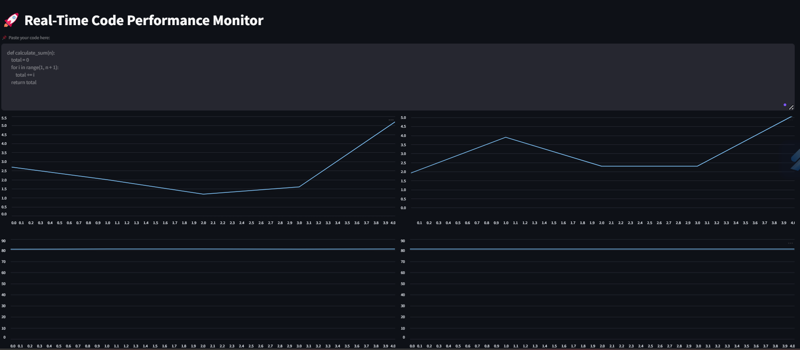
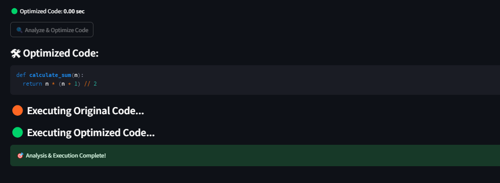

# 🚀 Real-Time Code Performance Monitor

A powerful **AI-driven tool** that **analyzes Python code**, **optimizes it using AI**, and **visualizes performance metrics** in real-time. It monitors **CPU & memory usage**, estimates **time complexity**, and provides **optimized code suggestions**.

---

## 🔥 Features
✅ **Real-time Code Execution Monitoring**  
⚡ **AI-Powered Code Optimization (Using Gemini AI)**  
📊 **CPU & Memory Usage Visualization**  
⏳ **Execution Time Comparison**  
📈 **Time & Space Complexity Estimation**  
🎯 **Simple, Interactive UI with Streamlit**  

---

## 🚀 How to Run Locally

### 1️⃣ Clone the Repository  
To start, clone this repository:

```sh
git clone https://github.com/your-username/real-time-code-optimizer.git
cd real-time-code-optimizer
```

### 2️⃣ Install Dependencies  
Ensure you have **Python 3.8+** installed. Then, install the required dependencies:

```sh
pip install -r requirements.txt
```

### 3️⃣ Set Up Your API Key  
Export your **Gemini AI API Key** (required for AI-powered optimization).  

#### **For Windows (Command Prompt / PowerShell):**
```sh
set GEMINI_API_KEY="your_api_key_here"
```

#### **For Mac/Linux (Terminal):**
```sh
export GEMINI_API_KEY="your_api_key_here"
```

### 4️⃣ Start the Flask API  
Run the Flask backend that handles code optimization:

```sh
python app.py
```

### 5️⃣ Start the Streamlit Dashboard  
Run the Streamlit-based UI:

```sh
streamlit run dashboard.py
```

Once started, **open the given local URL (e.g., http://localhost:8501) in your browser** to use the Real-Time Code Performance Monitor.

---

## 📸 Screenshots  

### 🔍 **Performance Monitoring Dashboard**


### 🔥 **Optimized Code Suggestions**


---

## ⚙️ Technologies Used  

| Technology | Purpose |
|------------|---------|
| 🐍 Python | Programming Language |
| 🌐 Flask | API for Code Optimization |
| 🎨 Streamlit | Interactive Dashboard |
| 📈 Psutil | CPU & Memory Monitoring |
| 🧠 Google Gemini AI | AI-powered Code Optimization |
| 📊 Pandas | Data Processing for Graphs |

---

## 🤝 Contributing  

Contributions are welcome! To contribute:  
1. Fork this repository.  
2. Create a new branch (`git checkout -b feature-branch`).  
3. Commit your changes (`git commit -m "Add new feature"`).  
4. Push the branch (`git push origin feature-branch`).  
5. Open a Pull Request.

---

### 📬 Need Help?  
For any issues, please open an [issue](https://github.com/Tejaswini0615/realtime-code-optimizer/issues) or contact me at **tejaswinidubey066@gmail.com**.

---
## 🛡 License
This project is licensed under the **MIT License** – see the [LICENSE](LICENSE) file for details.

---
